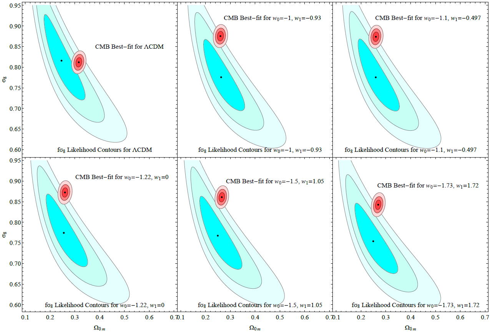

# Late time approaches to the Hubble tension deforming H(z) worsen the growth tension

This is the repository that contains the Mathematica code as well as useful comments that reproduce the figures of [arxiv:2012.13932](https://arxiv.org/abs/2012.13932).

## Abstract
Many late time approaches for the solution of the Hubble tension use a late time smooth deformation of the Hubble expansion rate $H(z)$ of the Planck/$\Lambda$CDM best fit $H(z)$ to match the locally measured value of $H_0$ while effectively keeping the comoving distance to the last scattering surface $r(z_{rec})$ and $\omega_m\equiv \Omega_{0m} h^2$ fixed to maintain consistency with Planck CMB measurements. A well known problem of these approaches is that they worsen the fit to low $z$ distance probes (BAO and SnIa). Here we show that another problem of these approaches is to worsen the level of the $\Omega_{0m}-\sigma_8$ growth tension. We use the CPL parametrization of $H(z)$ corresponding to evolving dark energy equation of state parameter  $w(z)=w_0+w_1\frac{z}{1+z}$  with local measurements $H_0$ prior and fixed values of $\Omega_{0m} h^2$ and $r(z_{rec})$ and identify the pairs $(w_0, w_1)$ that satisfy these conditions. We show that for these models the $\Omega_{0m}-\sigma_8$ tension between dynamical probe data (redshift space distortions) and CMB constraints is worse than the corresponding tension that appears in the case of the standard \plcdm model. We justify this feature using  a full numerical solution of the growth equation and fit to the data  and also using approximate analytic properties of the growth factor of perturbations $\frac{\delta \rho}{\rho}(z)$ solution. This  problem of late time $H(z)$ deformations is similar to a corresponding problem that exists for early time approaches to the Hubble crisis which also tend to increase the growth tension. The problem does not affect recent proposed solutions of the Hubble crisis involving a low $z$ gravitational transition that actually can resolve the growth tension.

## Citing the paper 
If you use any of the above codes or the figures in a published work please cite the following paper:
 *Late time approaches to the Hubble tension deforming H(z) worsen the growth tension*
 George Alestas and Leandros Perivolaropoulos, [arxiv:2012.13932](https://arxiv.org/abs/2012.13932)

Any further questions/comments are welcome.

## Authors List
George Alestas - <g.alestas@uoi.gr>
 Leandros Perivolaropoulos - <leandros@uoi.gr>
